# ModCloth HipChat emoticons

We've expanded on the core set of [emoticons included with HipChat](http://hipchat-emoticons.nyh.name) and added our own.
Some of these were lifted from [emoticonHQ](http://emoticonhq.com/skypeemoticons.html) and [FourKitchens](https://github.com/fourkitchens/hipchat-emoticons).
Also, let the [EZgif animated GIF resizer](http://ezgif.com/resize) become your friend!
Latest hipchat emoticon news is the size limit has been expanded to 30px by 30px and the number of custom emoticons upped to 100!

## Emoticons

 (accepted)
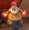 (alert)
 (ambulance)
 (angry)

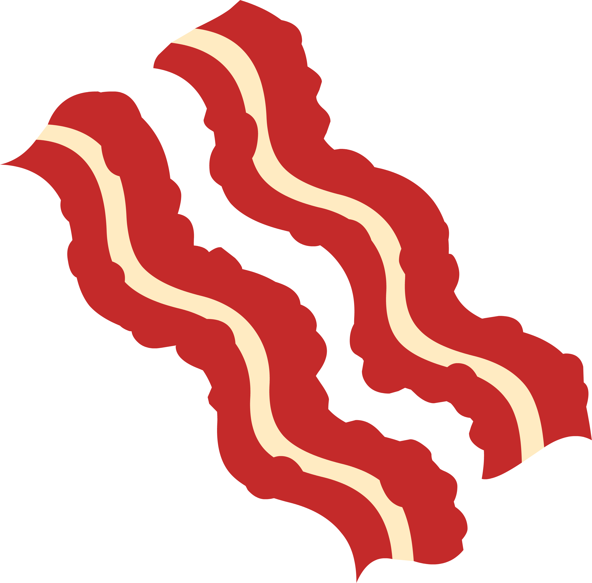 (bacon)
 (bandit)
 (billnye)
 (bluesteel)

 (blush)
 (bow)
 (brb)
 (bueller)

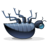 (bug)
 (bushes)
 (callme)
 (clap)

 (crying)
 (danceparty)
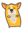 (dancingcorgi)
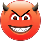 (devil)

 (disapprovingkari)
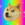 (doge)
 (doh)
 (drunk)

 (dude)
 (dull)
 (emo)
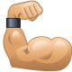 (flex)

 (giggle)
 (hack)
 (handshake)
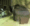 (headbang)

 (heartbeat)
 (inlove)
 (koger)
 (lifeishard)

 (macatoontown)
 (michaelscott)
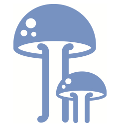 (modcloth)
 (n)

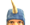 (narwhal)
 (nerd)
 (nod)
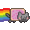 (nyancat)

 (oreo)
 (party)
 (penguin)
 (pharrell)

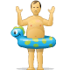 (poolparty)
 (puke)
 (rain)
 (rock)

 (rofl)
 (shake)
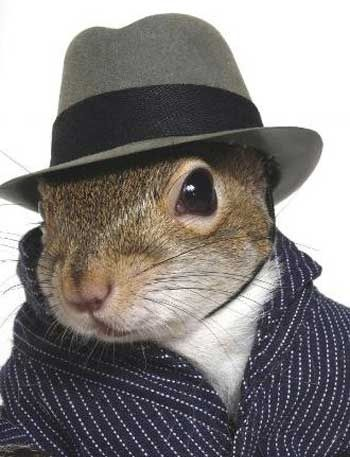 (shipit)
 (shipitgood)

 (shocked)
 (smoking)
 (sun)
 (swear)

 (sweating)
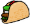 (taco)
 (tmi)
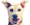 (tofu)

 (udi)
 (wait)
 (wave)
 (whew)

 (winston)
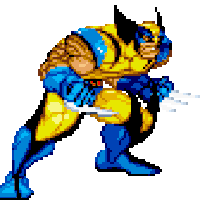 (wolverine)
 (worried)
 (y)

 (yawn)
 (yinyang)
 (yum)
 (x)

## Creating your own emoticons

We are using HipChat's built-in emoticon feature, which means an admin must upload the image in order for it to work. However, you can still create a pull request to get your icon into the repo, then let a HipChat admin know.

* Max dimensions are 30px tall and 30px wide
* Use a transparent PNG or animated GIF for best results
* Images must be under 100Kb
* Currently limited to 100 custom emoticons

## Need more emojis?

From the chat window press `ctrl+cmd+space` to bring up the emoji window.
