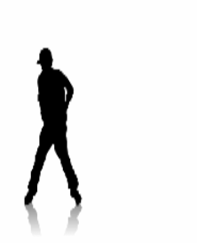
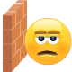
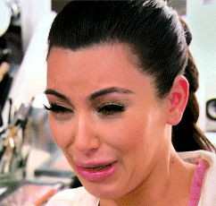
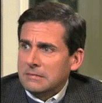
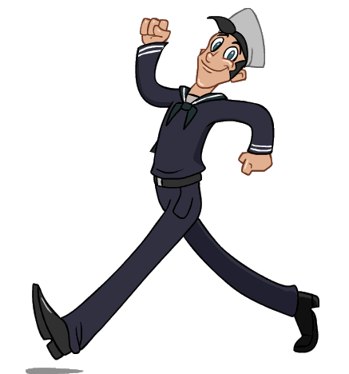

# ModCloth HipChat emoticons

We've expanded on the core set of [emoticons included with HipChat](http://hipchat-emoticons.nyh.name) and added our own.
Some of these were lifted from [skype emoticons](https://support.skype.com/en/faq/FA12330/what-is-the-full-list-of-emoticons) and [FourKitchens](https://github.com/fourkitchens/hipchat-emoticons).
Also, let the [EZgif animated GIF resizer](http://ezgif.com/resize) become your friend!

## Emoticons

 (accepted)
 (alert)
 (ambulance)
 (angry)

 (bacon)
 (bandit)
 (bluesteel)
 (blush)

 (bow)
 (breakdance)
 (brb)
 (bug)

 (callme)
 (cat)
 (clap)
 (crying)

 (carlton)
 (celebrate)
 (dancingcorgi)
 (devil)

 (dog)
 (doh)
 (drunk)
 (dude)

 (dull)
 (emo)
 (ermygerd)
 (flex)

 (giggle)
 (gottarun)
 (handshake)
 (headbang)

 (heartbeat)
 (inlove)
 (lalala)
 (leftshark)

 (lifeishard)
 (michaelscott)
 (modcloth)
 (n)

 (nerd)
 (nod)
 (party)
 (penguin)

 (poolparty)
 (puke)
 (rain)
 (rock)

 (rofl)
 (shake)
 (shipit)
 (smoking)

 (stop)
 (sun)
 (swear)
 (sweating)

 (tmi)
 (tumbleweed)
 (wait)
 (walk)

 (wave)
 (wfh)
 (whew)
 (winston)

 (wolverine)
 (worried)
 (x)
 (y)
 (yawn)

## Creating your own emoticons

* Use a transparent PNG or animated GIF 100px by 100px or larger for best results.

## Need more emojis?

From the chat window press `ctrl+cmd+space` to bring up the emoji window.
